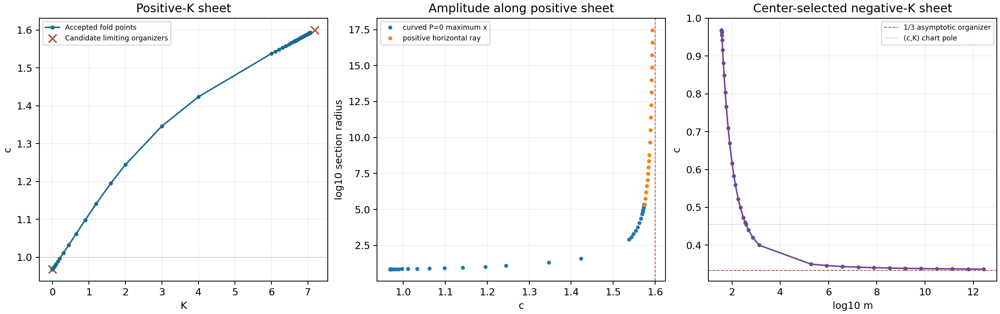

# KKL fold-surface strike

This work continues `main` commit `79001f70eb180331f5ac0b740f5d5aadfe833329`.
The previous 400 KKL and 150 Shi/Chen–Wang evaluations were not repeated.

**Status: partial continuation, no K1 candidate and no five-cycle candidate.**
The finite fold is supported by numerical evidence: augmented shooting, independent
trajectory formulations, and two-sided shooting consistently reproduce it.
The positive-K component has been followed toward both a finite center orbit
and an infinity connection. A separate regular negative-K sheet selected by
the same center unfolding has also been followed. Neither sparse root profiles
nor numerical endpoint convergence prove an exhaustive component result.
None of mathematical stopping conditions A–D has been established. Discovery
was stopped at the user's explicit instruction to finish and push the findings.
This is an open research checkpoint, not a component kill or a counterexample.

## What was completed and what was not

**Completed:** continued the finite-fold equations in both positive-K directions;
repaired large-radius conditioning with two-sided binary128 shooting; followed
the center-selected negative-K sheet through the c=5/11 chart singularity;
saved every accepted/rejected event and evaluation; derived and checked exact
topology identities and conditional endpoint asymptotics; independently
reviewed the equations and saved signs; reproduced selected two-cycle fields
with complete returns; preserved rational coefficient vectors and replay data.

The final positive-sheet accepted point has horizontal r approximately
2.9588131143e17, c=1.5934058052781371, K=7.0639070043677991. Its nearby pair
is supported by two-sided matching brackets. Complete-return cross-formulation
reproduction was completed at the earlier positive-sheet field near r=1e14
and at the final large-m field. The prepared `outermost_replay.py` for the
last positive-sheet field was **not run**, because discovery/replay work was
stopped on the user's instruction.

**Not completed:** an exhaustive continuation/enclosure of the entire connected
fold component; isolation of every possible origin return root; proofs of the
candidate limiting connections and absence of other branches; a field with
three origin cycles; a 3+1 precursor; beta/Hopf completion to five; hostile
reproduction of a >=5-cycle candidate; interval certification. No such
candidate was found or is claimed. The remaining 43 campaign calls were not
spent after the stop instruction.

## Field and starting fold

Throughout discovery beta=0 and

\[
\dot x=(1+x)y+x^2,\qquad
\dot y=-10x^2+\frac{11}{5}xy+cy^2-mx,
\quad m=\frac{5(K+42)}{11c-5}.
\]

The inherited starting fold is

\[
K=1/512,\quad c\simeq0.9688884793906646,\quad
r_{P=0}\simeq6.949087993605231.
\]

Its section is sigma(r)=(r,-r²/(1+r)), the maximum-x crossing for an origin
cycle. The previous commit's independent Cartesian trajectory test supports
its nearby pair; see `STAGED_RUN_2026_09_05.md` and the archived
`staged_2026_09_05/` records. New analytic variational controls reproduce the
fold conditions and give approximately
`d(log r)/dK=0.11351275`, `dc/dK=0.13716438` there.

No remote-cycle gate was imposed on this continuation. No existing simple
cycle was substituted for the augmented fold equations.

## Equations, coordinate changes, and complete-return meaning

The first solver integrates the orbit and first/mixed-second variations in
Cartesian coordinates, with moving-section corrections. It solves
`L=log(R/r)=0`, `L_z=0`, where z=log r. The fold Jacobian uses L_zz and L_zc.
A log-polar, rescaled-time version avoids the old finite radius cutoff.
Pseudoarclength continuation in `(log r,c,K)` retains a branch through an
ordinary turning point of a parameter projection.

At large amplitude the first-variation calculation and the parameter
predictor became ill-conditioned. These failures were retained as unresolved
corrections. They were repaired using an angular formulation, binary128
arithmetic, and then a bounded matching section:

* Start at `(r,0)` and integrate clockwise to the negative horizontal ray.
  Denote the final log radius by A(z).
* From the same `(r,0)`, integrate backward to the negative ray and denote
  the final log radius by B(z).
* Integrate the sensitivities `A'=exp(M_f)`, `B'=exp(M_b)` and solve
  `F=A-B=0`, `G=M_f-M_b=0`.

Where both half passages exist in the same monotone angular chart, the
complete return is `P=B^{-1} o A`. Thus F=0 closes one full clockwise orbit,
and at that root the multiplier is exp(G). Moreover

\[
F_z=e^{M_b}\operatorname{expm1}(G),\qquad
F_{zz}=e^{M_b}G_z\quad\text{at a fold}.
\]

The Newton systems use analytic derivatives of these expressions. G=0 finds
stationary branches of the *matching residual*. Away from a root these are
not generally the stationary points of the composed full-return displacement.
All successful half passages carry their negative-ray endpoints and physical
passage times; only a match represents a periodic orbit. Approximate matches
remain numerical evidence, not interval existence certificates.

Both the long-double and binary128 sources implement modified-midpoint
extrapolation. Stage checks enforce clockwise angular motion. This is not a
proof of monotonicity between integration stages or of coverage of every
possible origin cycle. A lost angular chart is unresolved, not cycle absence.

Pair-side offsets use the sign of the unfolding derivative **and curvature**.
Near a fold a shift delta c is selected so `F_c * delta c` has the opposite
sign from F_zz. The independent reviewer caught the earlier implicit
positive-curvature assumption and an unresolved-refinement handling defect;
both were corrected before exploring the negative-curvature sheet.

## Events and root accounting

The complete saved event ledger is
[`fold_surface_2026_09_05/EVENT_LEDGER.md`](fold_surface_2026_09_05/EVENT_LEDGER.md).
Its machine counterpart is `component_summary.json`. The `events_*.json`
files retain corrector histories, rejected predictors, section data, derivatives,
root brackets, stationary brackets and sampled displacement signs.
`returns.jsonl` is the append-only evaluation record, including failures.

Root brackets are ordered by section radius. On the positive-K pair side,
the observed inner root is stable and the outer root unstable. On the
center-selected negative-K sheet these stabilities reverse. Every profile
explicitly records that exhaustive root coverage is unproved. Refinement
records preserve sign brackets rather than silently converting approximate
Newton roots into certified isolated cycles.

One early K=6 excursion used a c offset of +0.012, too large to remain near
the increasingly narrow fold pair. It returned one root bracket. This is
not a fold rejection or a third-cycle obstruction; curvature-scaled offsets
subsequently recovered two brackets on the continuing branch. The numerical
losses at large radius likewise did not stop the branch: subsequent coordinate
and precision changes recovered it.

<!-- GENERATED_RESULTS -->
## Numerical checkpoint

This strike recorded **3297** charged calls, including unresolved attempts and separatrix passages. Together with the inherited 756, the campaign has used **4053/4096**, leaving **43**. No old 550-call stage was repeated.

| Sheet / event | K | c | section r | pair brackets |
|---|---:|---:|---:|---:|
| decreasing | 0.0001220703125 | 0.96863737077567 | 6.947634627432 | 2 |
| increasing | 6 | 1.5377596872835 | 823.5861819677 | 1 |
| arclength | 6.70042052611 | 1.5739771810938 | 214759.0158106 | 2 |
| quad | 7.06390700437 | 1.5934058052781 | 2.958813114325e+17 | 2 |
| negative | -30 | 0.47287693481153 | 16.27191084961 | 2 |
| m | -43472.1349892 | 0.35 | 3523.033376474 | 2 |
| logm | -717314104496 | 0.33668600865535 | 11970315900.32 | 2 |

The first three table rows use the curved maximum-x section; later rows use the positive horizontal ray. These section coordinates must not be equated. Full decimal values and every intermediate event are archived in the linked ledger.



The c=1 crossing is numerical at K=0.224215783967328786567399385115329013, horizontal r=6.95315434526927557067870425575470893; it is a regular finite fold, not loss at infinity.

At K=1e-9, the decreasing branch gives c=0.968620633690603897139694360227050151, horizontal r=6.75794351600223866723681265358655452, and (c-c*)/K=0.13710961097556896068906467775034209624.

At exact target c=8/5, finite-radius matching through r=1e14 gives K≈7.18499469640662040162379516212772519 and G≈-0.235674959517262116383210709565361526. The tighter r=1e17 control hit the CPU fuse; subsequent looser-tolerance controls completed and agree closely (see infinity_tolerance_control.json). The independent separatrix-series approach gives K≈7.18499469694; its roughly 5e-10 difference is numerical integration error, not a distinct connection.

The negative-K sheet crosses the removable (c,K) chart pole using independent coefficients (c,m). Its later growth motivates the separate large-m asymptotic analysis in the supplemental theory review. This sheet is included as an extension of the center unfolding, not as evidence that the positive-K regular component has been exhaustively completed.

Refined finite-radius matching at r=1e17 gives K≈7.18499469640662101398737799635205628, C≈0.82168694694497326755611158613486802, and conditional (1.6-c)log r limit≈0.2476456804760204319118242342327652. This is numerical/asymptotic evidence, not an exact connection certificate.

Complete-return root refinements are in `pair_replay_claims.json`, including rational coefficient vectors, preserved endpoint signs, periods and multipliers. Each row group is a separate two-cycle field; their cycles must not be added across fields.

| Field | Origin cycle | Approximate horizontal r | Period | Multiplier |
|---|---|---:|---:|---:|
| events_quad.json | 1 | 8.7981935402e+13 | 1.26301544512 | 0.999045918877 |
| events_quad.json | 2 | 1.13407241574e+14 | 1.26301544512 | 1.00105554344 |
| events_negative.json | 1 | 14.3542298818 | 0.327844142696 | 1.00563685295 |
| events_negative.json | 2 | 18.4890091237 | 0.323282955298 | 0.992675457797 |
| events_logm.json | 1 | 10524664759.6 | 3.2552817534e-06 | 1.00108409791 |
| events_logm.json | 2 | 13555129779.1 | 3.25527075122e-06 | 0.998672869213 |

<!-- END_GENERATED_RESULTS -->

## Center, infinity, and remote-stability relations

Let `J(c)=305+634c-11c²-1000c³` and let
`c*=0.96862063355349428616412539953799...` be its relevant algebraic root.
At `(K,c)=(0,c*)` the field has an exact reversible center foliation. The
approaching fold has finite amplitude, not an infinitesimal Hopf amplitude.
An independently derived exact first integral reduces its first-order
unfolding to two weighted area moments. Nonvalidated 45-digit quadrature gives

\[
r_{P=0}\to6.94753908\ldots,\qquad
\frac{c-c_*}{K}\to0.137109610961532\ldots.
\]

Binary128 shooting agrees with this slope. This tests the relation to the
nearby infinity-neutrality line: the finite fold meets that parameter line
at the center organizer in its closure. Proximity of c-values at the starting
point was not treated as evidence of an infinity mechanism. The center
annulus is a degenerate stratum, so the negative-K unfolding is a separate
regular sheet through its closure, not a passage through an ordinary fold.

For c>1 the two finite infinite singular points have slopes

\[
z_\pm=\frac{-6/5\pm\sqrt{40c-964/25}}{2(c-1)}.
\]

Their candidate graphic is neutral at the **exact** value c=8/5, not at c*.
At c=8/5 the slopes are `-1±sqrt(159)/3`, with saddle ratios 5/6 and 6/5.
Two independent numerical approaches locate the required interior connection:
local invariant-manifold series followed to a common bounded section, and
binary128 finite-radius matching with increasing starting radius. These
locate a candidate connection, not a rigorous enclosure of one.

Neutrality does not require the leading graphic coefficient C to equal one.
Under suitable uniform differentiated passage expansions, put
`d=sqrt(40c-964/25)`. The half-map exponent difference is exactly

\[
\Delta\nu=\frac{10d(8/5-c)}{61-5c},\qquad
\frac{\Delta\nu}{8/5-c}\to\frac{12}{\sqrt{159}}.
\]

If G_infinity is the limiting half-map log derivative ratio at the neutral
connected field, the predicted fold asymptotic is
`(8/5-c) log r -> -sqrt(159) G_infinity/12`.
At neutrality `log C=(5/6)G_infinity`. These are conditional asymptotic
relations; no remainder enclosure or theorem continuing the entire component
to the graphic is supplied.

On the positive-K range audited here, exact algebra gives one origin and one
remote antisaddle, separated by the transverse barrier x=-1. The remote trace
criterion extends beyond the old c<1.5 gate:

\[
K_H(c)=\frac{-441J(c)}{125(16-10c)(1+2c)^2},\quad c<8/5.
\]

All independently audited positive-K fold and pair fields satisfy `K<K_H(c)`
and have positive remote trace. This is a recorded relation, not a reason to
reject the finite fold or a proof that remote cycles cannot exist. The
original remote-cycle search was not started because no three-origin-cycle
precursor was found. Beta was not perturbed and no cycles from different
fields were combined.

## The negative-K sheet and its separate large-m organizer

The center-selected sheet retains an unstable/stable origin pair while its
origin weak focus is attracting. It crosses the infinity-direction collision
at c=241/250 and the removable (c,K) coordinate singularity at c=5/11 without
losing the finite fold. The latter crossing uses the actual coefficients
(c,m), so no division by 11c-5 is required. Continuation in log m recovers the
branch after a large c-step predictor and ordinary precision both fail.

The supplemental independent review is
[`theory_negative_review.md`](fold_surface_2026_09_05/theory_negative_review.md).
For 1/3<=c<=1 and m>=37, its exact topology gate gives only the origin and one
remote antisaddle. The remote Hopf threshold in these regular coordinates is

\[
m_H(c)=\frac{21(1000c^2+1021c+481)}{50(1+2c)^2(8-5c)}.
\]

Every audited negative-sheet fold and pair field has m>m_H and negative remote
trace. This does not supply a remote cycle. No three-origin-cycle nest was
found, so remote completion and beta perturbation were not triggered here.

With y=sqrt(m)Y and time scaled by sqrt(m), the m=infinity limit has a center
first integral. The leading large-energy Melnikov contributions have equal
powers at c=1/3, with coefficient ratio 19/25. Subject to an unproved uniform
joint-limit expansion, this predicts

\[
(c-1/3)\log r\longrightarrow\frac29\log(25/19)
\simeq0.06098596571.
\]

This identifies a separate candidate asymptotic organizer. c=1/3 is not a
finite-m hyperbolicity boundary, and these asymptotics do not prove the fold
must end there or exclude a third cycle.

## Exact statements versus numerical evidence

Exact algebraic identities and the center structure are in `theory_notes.md`
and `theory_exact.py`. An exact no-cycle gate at c=1, K>=6292/1125 was obtained,
but the continued fold crosses c=1 at a much smaller K; this gate does not kill
the component. A proposed rotated-family route fails because no nonzero
(c,m) parameter tangent has the required determinant sign around an entire
origin cycle. A Dulac reduction simplifies a residual to a linear factor, but
its missing positivity/topology argument is not supplied as a theorem.

`theory_angular_review.md` independently checks the variational and matching
formulas. `theory_outcome_review.md` audits saved signs, ordering, curvature
and exact finite-equilibrium gates. Independent review and two-cycle replay
are distinct from the requested >=5-cycle hostile reproduction trigger.
That trigger has not occurred.

No interval-arithmetic Poincare certificate is claimed. No global third-cycle
exclusion, exhaustive fold-component enclosure, uniqueness of the center
Melnikov stationary point, or complete classification of loss-of-return
boundaries is claimed. The large-amplitude endpoint and any unobserved branch
remain open. The next decisive work must address those gaps or produce an
additional root; the present profiles do not constitute a negative theorem.

## Replay and provenance

All executable sources, exact checks and high-precision decimal requests are
in `fold_surface_2026_09_05/`. The explicit field is determined by `(c,K)` and
the formula above, or by `(c,m)` when using the actual-coefficient chart.
Decimal coefficient strings can be read as exact rationals for replay; this
does not certify preservation of cycles under rounding.

Examples, from the repository root:

```bash
python fold_surface_2026_09_05/theory_exact.py
python fold_surface_2026_09_05/theory_outcome_audit.py
python fold_surface_2026_09_05/build_summary.py
```

For a single numerical replay, pipe an archived request from `returns.jsonl`
to its recorded evaluator. `half_quad.py` accepts JSON keys `r,c,K,tol`;
`half_m.py` accepts `r,c,m,tol`. Wrappers compile their neighboring C++ source
with g++; binary128 builds also use libquadmath. Full-return evaluators are
`angular_quad.py` and `angular_m_quad.py`. Python dependencies are NumPy,
SciPy, mpmath and SymPy. Scripts run under per-call CPU/wall fuses and report
unresolved integration rather than treating a timeout as nonexistence.

`source_manifest.json` records the final source hashes. Each ledger row records
its evaluator hash; later compiled-wrapper calls also record their C++
dependency hash. Earlier wrapper rows predate that extra dependency field;
their C++ sources are archived unchanged. Driver corrections are documented
above. No credential is stored in the repository.

## Repository integration note

Before publication, main advanced to `33e14fd` with an independent reversible
re-seed report. Both reports and their README/STATUS entries were preserved.
Its 24 return-difference evaluations are outside this strike's inherited
KKL/Shi ledger. The 4053 total and 43 unspent reported above refer to that
ledger; adding the separately reported 24 gives 4077 known calls (19 below
4096) if a single shared cap is applied to these two merged records. No
additional numerical work was performed during integration.
